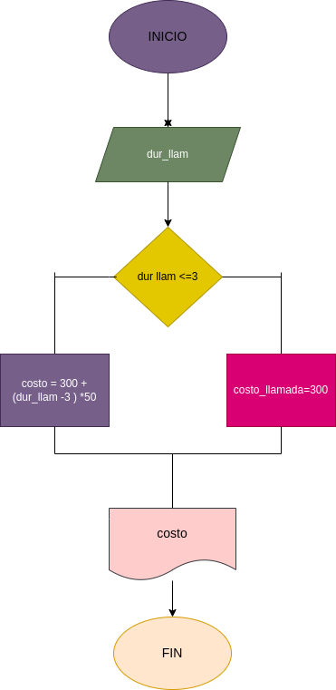

# llamada_telefonica

ingresar el tiempo de duracion de una llamada telefonica y determinar la catidad a pagar, de acuerdo con lo siguiente:
- toda llamada que dure 3 minutos o menos tiene costo de 300 pesos
- cada minuto adicional cuesta 50 pesos

# Diagrama de Flujo
